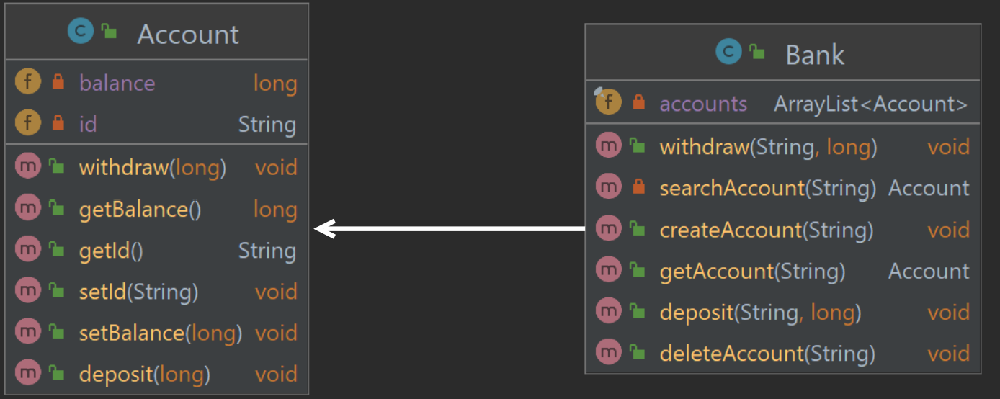
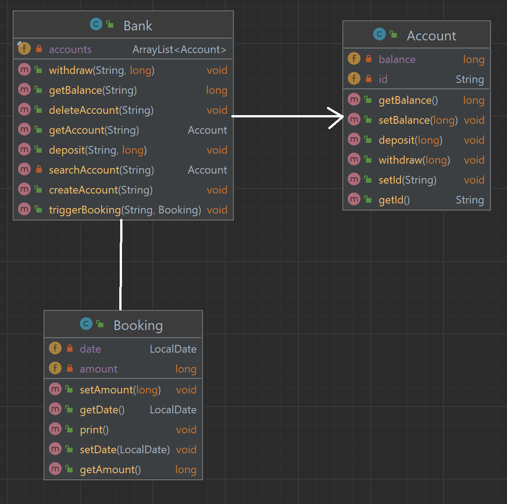
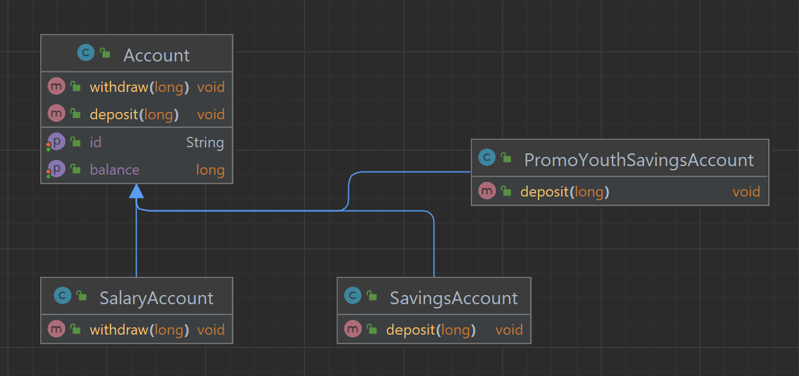
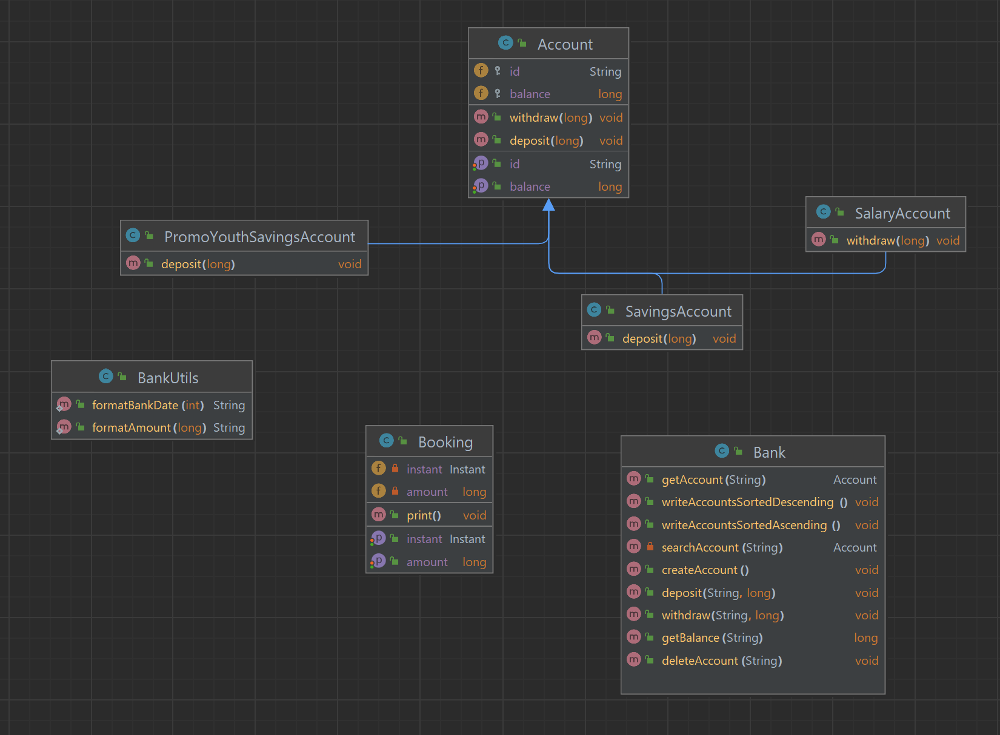
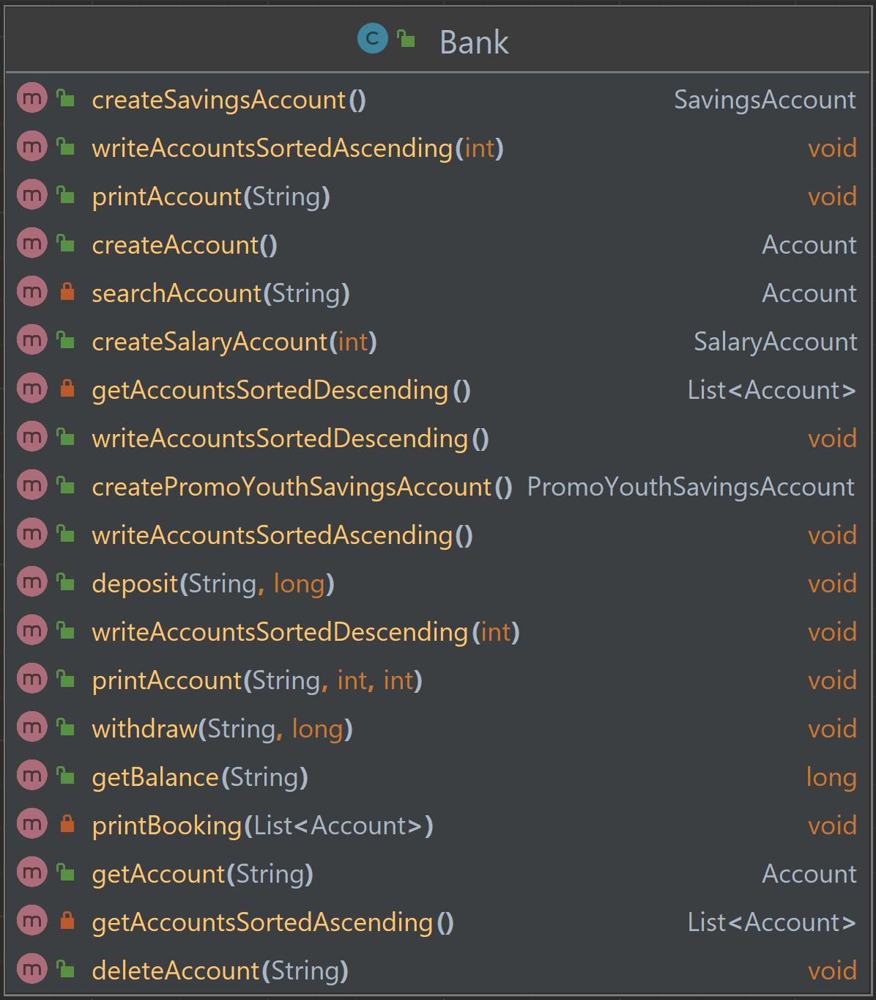
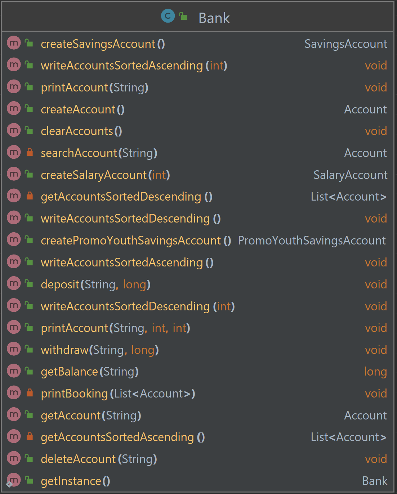

# BBW M326 Bank

In diesem Readme befinden sich die verschiedenen Anwendungsfälle, Aktivitäts- und Klassendiagramme zu allen Bank
Aufgaben.

## Bank 2

### Anwendungsfälle

#### Kontoeröffnung

| Name             | **Kunde eröffnet am Bankschalter ein Bankkonto**                                 |
|------------------|----------------------------------------------------------------------------------|
| Kurzbeschreibung | Der Bankangestellte eröffnet für den Kunden am Bankschalter ein neues Bankkonto. |
| Akteure          | Kunde, Bankangestellter                                                          |
| Auslöser         | Der Kunde möchte ein Konto eröffnen.                                             |
| Vorbedingungen   | Der Kunde muss vom Gesetz her berechtigt sein, ein Bankkonto zu eröffnen.        |
| Eingehende Infos | Personalien des Kunden                                                           |
| Ergebnis         | Bestätigung der Kontoeröffnung                                                   |
| Nachbedingung    | Für den Kunden wurde ein Bankkonto eröffnet.                                     |
| Ablauf           | 1. Bankkonto eröffnen   2. Eröffnung bestätigen                              |

#### Einzahlung und Auszahlung

| Name | **Kunde tätigt eine Ein- oder Auszahlung am Bankschalter
ein**                                         |
|------------------|--------------------------------------------------------------------------------------------------------|
| Kurzbeschreibung | Der Bankangestellte tätigt für den Kunden am Bankschalter eine Ein- oder Auszahlung. |
| Akteure | Kunde, Bankangestellter |
| Auslöser | Der Kunde möchte eine Ein- oder Auszahlung tätigen. |
| Vorbedingungen | Der Kunde muss ein Bankkonto besitzen. |
| Eingehende Infos | Kundenkonto, Geldmenge |
| Ergebnis | Bestätigung der Ein- oder Auszahlung |
| Nachbedingung | Für den Kunden wurde eine Ein- oder Auszahlung für sein Konto getätigt. |
| Ablauf | 1. Kundenkonto identifizieren   2. Geldmenge überprüfen   3. Auf Bankkonto ein- oder auszahlen |

#### Kontoauszug

| Name             | **Kunde erhält einen Kontoauszug für sein Bankkonto**                  |
|------------------|------------------------------------------------------------------------|
| Kurzbeschreibung | Der Bankangestellte gibt dem Kunden am Bankschalter einen Kontoauszug. |
| Akteure          | Kunde, Bankangestellter                                                |
| Auslöser         | Der Kunde möchte einen Kontoauszug für sein Konto erhalten.            |
| Vorbedingungen   | Der Kunde muss ein Bankkonto besitzen.                                 |
| Eingehende Infos | Kundenkonto                                                            |
| Ergebnis         | Kunde erhält Kontoauszug                                               |
| Nachbedingung    | -                                                                      |
| Ablauf           | 1. Kundenkonto identifizieren   2. Kontoauszug ausgeben            |

### Klassendiagramm

## Bank 3

#### Buchung auslösen

| Name             | **Kunde löste eine Buchung für sein Bankkonto aus**     |
|------------------|---------------------------------------------------------|
| Kurzbeschreibung | Der Kunde teilt dem Bankangestellter seine Buchung mit. |
| Akteure          | Kunde, Bankangestellter                                 |
| Auslöser         | Der Kunde möchte eine Buchung für sein Konto auslösen.  |
| Vorbedingungen   | Der Kunde muss ein Bankkonto besitzen.                  |
| Eingehende Infos | Kundenkonto, Geldmenge                                  |
| Ergebnis         | Geldmenge wird ein- oder ausgezahlt                     |
| Nachbedingung    | -                                                       |
| Ablauf           | 1. Kundenkonto identifizieren   2. Buchung auslösen |

### Klassendiagramm

## Bank 4

#### Lohn-, Spar- und Jugendsparkonto eröffnen

| Name             | **Kunde eröffnet ein Lohn-, Spar- oder Jugendsparkonto**      |
|------------------|---------------------------------------------------------------|
| Kurzbeschreibung | Der Kunde teilt dem Bankangestellter seine Art von Konto mit. |
| Akteure          | Kunde, Bankangestellter                                       |
| Auslöser         | Der Kunde möchte eine neue Art von Konto eröffnen.            |
| Vorbedingungen   | Der Kunde muss ein Bankkonto besitzen.                        |
| Eingehende Infos | Kundenkonto, Art von Konto                                    |
| Ergebnis         | Ein Lohn-, Spar- oder Jugendsparkonto wurde eröffnet.         |
| Nachbedingung    | -                                                             |
| Ablauf           | 1. Kunde identifizieren   2. Konto eröffnen               |

### Klassendiagramm

## Bank 5

#### Alle Konten auf- und absteigend sortiert ausgeben

| Name             | **Alle Konten auf- und absteigend sortiert ausgeben**                        |
|------------------|------------------------------------------------------------------------------|
| Kurzbeschreibung | Der Bankangestellte zeigt alle Konten an.                                    |
| Akteure          | Bankangestellter                                                             |
| Auslöser         | Der Bankangestellte möchte alle Konten anzeigen.                             |
| Vorbedingungen   | Die Bank muss Kunden haben.                                                  |
| Eingehende Infos | -                                                                            |
| Ergebnis         | Alle Konten wurden ausgegeben.                                               |
| Nachbedingung    | -                                                                            |
| Ablauf           | 1. Auf- oder absteigend sortiert auswählen   2. Konten werden ausgegeben |

### Klassendiagramm

## Bank 6

#### Lohn-, Spar- und Jugendsparkonto eröffnen

| Name             | **Kunde eröffnet ein Lohn-, Spar- oder Jugendsparkonto**      |
|------------------|---------------------------------------------------------------|
| Kurzbeschreibung | Der Kunde teilt dem Bankangestellter seine Art von Konto mit. |
| Akteure          | Kunde, Bankangestellter                                       |
| Auslöser         | Der Kunde möchte eine neue Art von Konto eröffnen.            |
| Vorbedingungen   | Der Kunde muss ein Bankkonto besitzen.                        |
| Eingehende Infos | Kundenkonto, Art von Konto                                    |
| Ergebnis         | Ein Lohn-, Spar- oder Jugendsparkonto wurde eröffnet.         |
| Nachbedingung    | -                                                             |
| Ablauf           | 1. Kunde identifizieren   2. Konto eröffnen               |

### Klassendiagramm

## Bank 7

#### Eine Bank Instanz erstellen

| Name             | **Bankangestellter erstellt eine Instanz der Bank**             |
|------------------|-----------------------------------------------------------------|
| Kurzbeschreibung | Der Bankangestellte erstellt eine Instanz der Bank.             |
| Akteure          | Bankangestellter                                                |
| Auslöser         | Der Bankangestellte möchte nur eine Instanz der Bank erstellen. |
| Vorbedingungen   | Es darf keine andere Instanz der Bank existieren.               |
| Eingehende Infos | -                                                               |
| Ergebnis         | Eine Instanz der Bank wurde erstellt.                           |
| Nachbedingung    | -                                                               |
| Ablauf           | 1. Instanz erstellen                                            |

### Klassendiagramm

